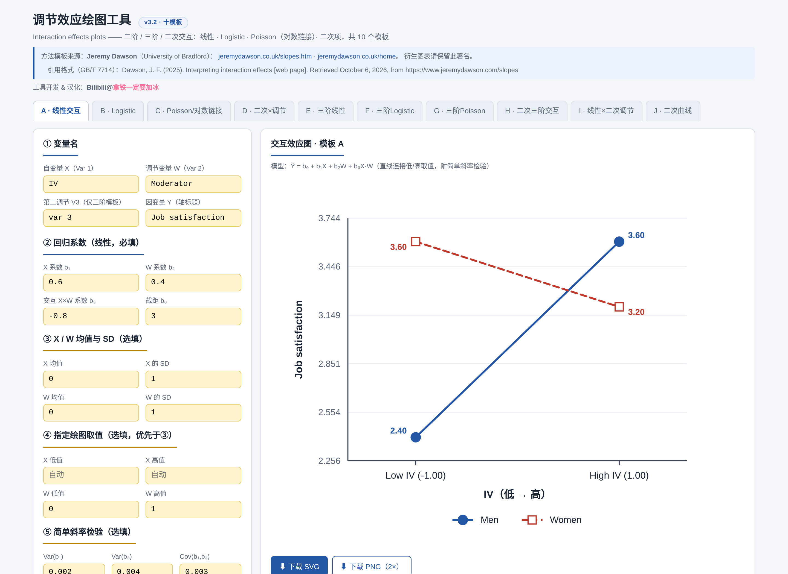
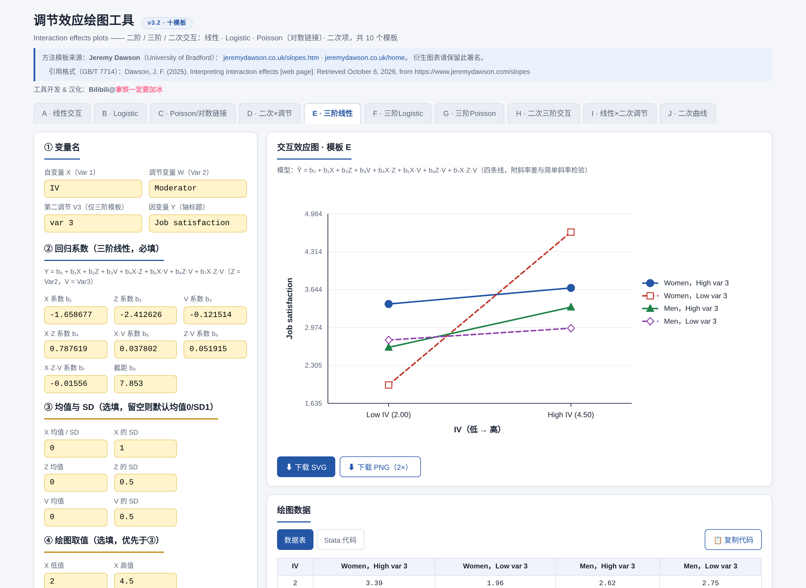
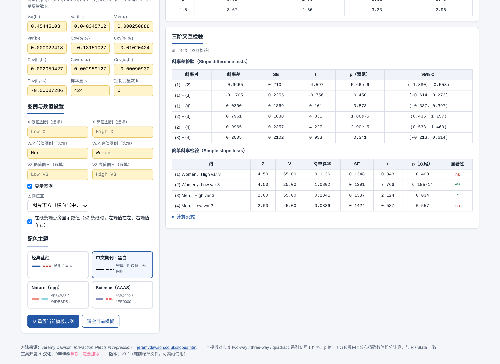
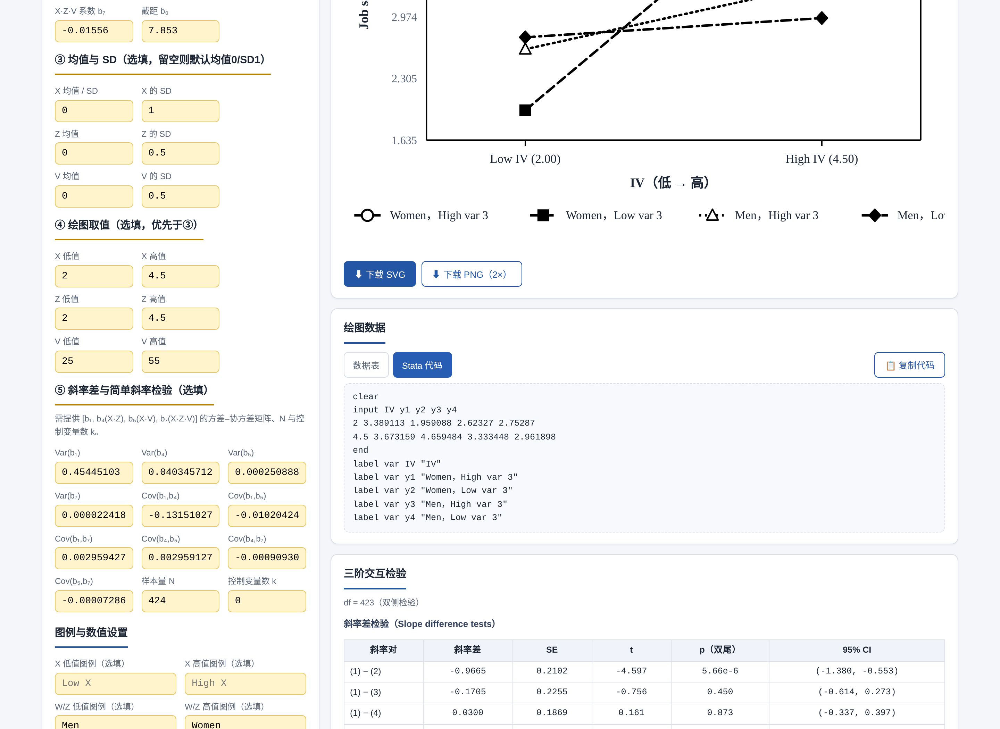

# 调节效应绘图工具 · Moderation Plot Tool

基于回归系数绘制 **二阶 / 三阶 / 二次调节效应图** 的纯前端单页应用。无需安装、无需联网、无需任何依赖，双击 `index.html` 即可使用。

方法模板来自 **Jeremy Dawson**（University of Bradford）的 Excel 交互效应工作表系列
（[jeremydawson.co.uk/slopes.htm](https://www.jeremydawson.co.uk/slopes.htm)）。



---

## ✨ 功能特性

- **10 个绘图模板**：覆盖线性 / Logistic / Poisson（对数链接）/ 二次项的两交互与三交互情形
- **简单斜率检验与斜率差检验**（模板 A / E）：输入方差–协方差矩阵后自动计算 t 值、双尾 p 值与 95% 置信区间
- **4 套出版级配色主题**：经典蓝红、中文期刊黑白（宋体·四边框·线型区分）、Nature（npg）、Science（AAAS）
- **图例灵活布局**：图片下方（横向居中一行）或图片右方（纵向居中一列）
- **端点数值标注**（可选）：左端值在左、右端值在右，自动避让留白
- **一键导出** SVG / 高清 PNG（2×）
- **Stata 代码生成**：绘图数据一键转为 `clear + input` 可粘贴代码，附变量标签
- **全中文界面**，所有计算在浏览器本地完成，数据不出本机

## 🚀 快速开始

### 方式一：本地使用（推荐）

下载本仓库，用浏览器（Chrome / Edge / Firefox）打开 `index.html` 即可，完全离线可用。

### 方式二：GitHub Pages

Fork 本仓库后，在 Settings → Pages 中选择 `main` 分支根目录部署，即可通过网址在线使用。

## 📊 十个模板

| 模板 | 模型 | 线条数 | 附检验 |
|---|---|---|---|
| A · 线性交互 | Ŷ = b₀+b₁X+b₂W+b₃X·W | 2 | 简单斜率检验 |
| B · Logistic | p = 1/(1+e^−η)，η = b₀+b₁X+b₂W+b₃X·W | 2 | — |
| C · Poisson / 对数链接 | log E(Y) = η，E(Y) = e^η | 2 | — |
| D · 二次×调节 | Ŷ = b₀+b₁X+b₂X²+b₃W+b₄X·W+b₅X²·W | 2 | — |
| E · 三阶线性 | Ŷ = b₀+b₁X+b₂Z+b₃V+b₄X·Z+b₅X·V+b₆Z·V+b₇X·Z·V | 4 | 斜率差检验 + 简单斜率检验 |
| F · 三阶 Logistic | η 同上 8 项，p = 1/(1+e^−η) | 4 | — |
| G · 三阶 Poisson | η 同上 8 项，E(Y) = e^η | 4 | — |
| H · 二次三阶交互 | Y = b₀+b₁X+b₂Z+b₃V+b₄X²+b₅X·Z+b₆X·V+b₇X²·Z+b₈X²·V+b₉Z·V+b₁₀X·Z·V+b₁₁X²·Z·V | 4 | — |
| I · 线性×二次调节 | Ŷ = b₀+b₁X+b₂W+b₃W²+b₄X·W+b₅X·W²（X/W 各取低/中/高） | 3 | — |
| J · 二次曲线 | Ŷ = b₀+b₁X+b₂X² | 1 | — |

每个模板均预置与原 Excel 工作表一致的示例数据，点击「重置当前模板示例」即可对照核对。



## 🎨 配色主题



| 主题 | 说明 |
|---|---|
| 经典蓝红 | 默认，适合演示与日常分析 |
| 中文期刊 · 黑白 | 纯黑线型（实线○/虚线■/点线△/点划◆）+ 宋体/Times 衬线字体 + 四边框，符合国内期刊投稿要求 |
| Nature（npg） | `#E64B35 / #4DBBD5 / #00A087 / #3C5488` |
| Science（AAAS） | `#3B4992 / #EE0000 / #008B45 / #631879` |

## 🧮 统计方法说明

- **绘图点优先级**：手动指定取值 > 均值±1SD（或指定倍数）> 默认 −1/+1
- **简单斜率**（W = w 处）：s(w) = b₁ + b₃·w；Var[s(w)] = Var(b₁) + w²·Var(b₃) + 2w·Cov(b₁,b₃)，t = s/√Var，df = N − k − 1
- **三阶斜率差**：对 [b₁, b₄, b₅, b₇] 的协方差矩阵 Σ，差值方差 = c′Σc；95% CI = 差值 ± t(0.975, df)·√Var
- **p 值**由 t 分布精确数值积分（正则不完全贝塔函数）计算，与 R / Stata 结果一致；旧版 Excel 模板在 |t| 极大时可能有显示误差

## 📦 Stata 代码导出

「绘图数据」卡片可切换为 **Stata 代码**视图，生成可直接粘贴运行的代码：

```stata
clear
input IV y1 y2
-1 2.4 3.6
1 3.6 3.2
end
label var IV "IV"
label var y1 "Men"
label var y2 "Women"
```



## 📝 引用

工具开发 & 汉化：**Bilibili@[拿铁一定要加冰](https://space.bilibili.com/40545247)**

方法模板请按国标格式引用：

> Dawson, J. F. (2025). *Interpreting interaction effects* [web page]. Retrieved October 6, 2026, from https://www.jeremydawson.com/slopes

## 📜 许可

[MIT License](LICENSE) — 可自由使用、修改与分发；衍生图表请保留 Dawson 的方法署名。

## 🗂 版本历史

| 版本 | 说明 |
|---|---|
| v3.2 | 图例限定下方居中一行/右方居中一列；移除图片注释；新增 Stata 代码导出 |
| v3.1 | 新增模板 I（线性×二次调节）、J（二次曲线）；图例 6 位置 × 2 排列；端点数值左右放置；新增 GB/T 引用 |
| v3.0 | 新增四个三阶交互模板（E–H，含斜率差与简单斜率检验）；排版与留白优化 |
| v2.0 | 新增 Logistic / Poisson / 二次模板（B–D）；四套配色主题；图例与注释自定义 |
| v1.0 | 首个版本：线性交互模板 + 简单斜率检验 |
